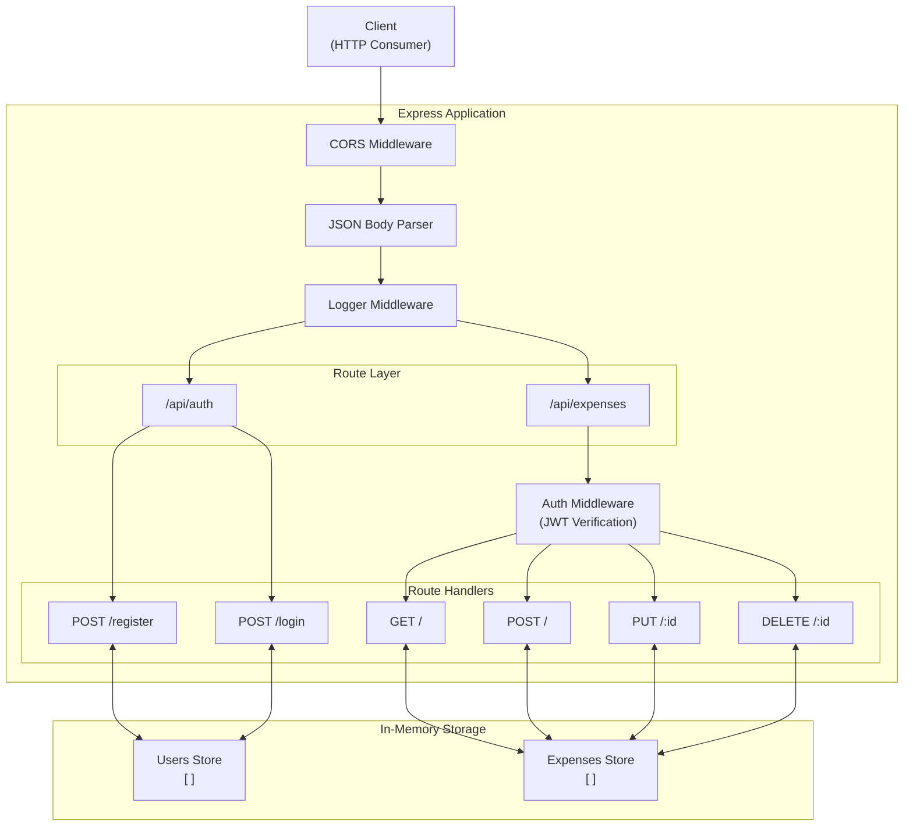
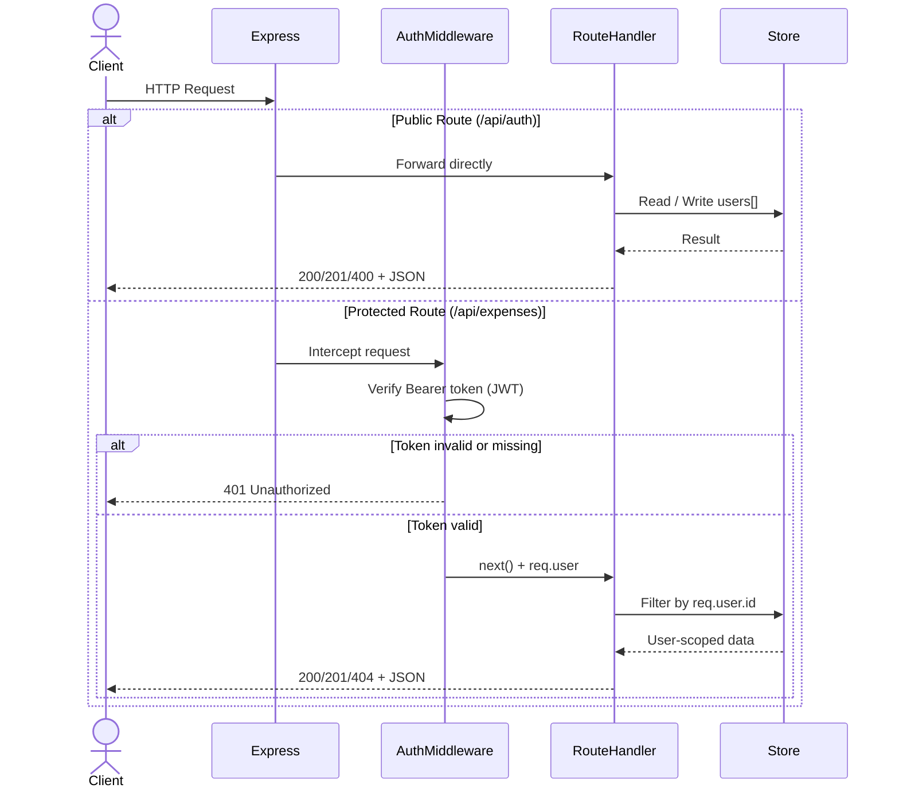
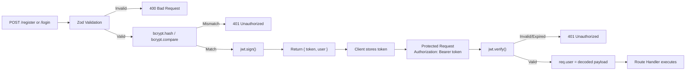

# Expense Tracker API

A lightweight, stateless REST API for tracking personal expenses. Built with Node.js and Express, it features JWT-based authentication, per-user data isolation, and Zod-powered request validation.

## Table of Contents

- [System Architecture](#system-architecture)
- [Request Lifecycle](#request-lifecycle)
- [Project Structure](#project-structure)
- [Tech Stack](#tech-stack)
- [Getting Started](#getting-started)
- [Environment Variables](#environment-variables)
- [API Reference](#api-reference)
- [Data Models](#data-models)
- [Authentication Flow](#authentication-flow)

## System Architecture



## Request Lifecycle



## Project Structure

```
expense-tracker-api/
├── backend/
│   ├── src/
│   │   ├── middleware/
│   │   │   ├── auth.js          # JWT verification middleware
│   │   │   └── logger.js        # Request logging middleware
│   │   └── routes/
│   │       ├── auth.js          # /api/auth — register & login
│   │       ├── expenses.js      # /api/expenses — CRUD operations
│   │       └── userRoutes.js    # User-related route bindings
│   ├── index.js                 # App entry point, middleware & route mounting
│   ├── package.json
│   └── .env                     # Environment variables (not committed)
├── frontend/
│   ├── src/
│   │   ├── api/
│   │   │   └── client.ts        # Typed API client
│   │   ├── components/
│   │   │   ├── ConfirmModal.tsx
│   │   │   ├── ExpenseCard.tsx
│   │   │   ├── ExpenseForm.tsx
│   │   │   ├── Navbar.tsx
│   │   │   └── StatsRow.tsx
│   │   ├── context/
│   │   │   └── AuthContext.tsx  # Global Auth Context & Provider
│   │   ├── hooks/
│   │   │   ├── useAuth.ts
│   │   │   └── useExpenses.ts
│   │   ├── pages/
│   │   │   ├── AuthPage.tsx
│   │   │   └── DashboardPage.tsx
│   │   ├── types/
│   │   │   └── index.ts         # TypeScript interfaces
│   │   ├── App.tsx              # Component router (Auth vs Dashboard)
│   │   ├── index.css            # Wine red and Sand design system
│   │   └── main.tsx             # React DOM entry point
│   ├── index.html
│   ├── package.json
│   ├── tsconfig.json
│   └── vite.config.ts
├── .gitignore
└── README.md
```

## Tech Stack

### Backend
| Layer | Technology | Purpose |
|---|---|---|
| Runtime | Node.js | JavaScript server runtime |
| Framework | Express v5 | HTTP routing and middleware |
| Validation | Zod | Schema-based request validation |
| Authentication | jsonwebtoken | JWT signing and verification |
| Password Hashing | bcryptjs | Secure password hashing (salt rounds: 10) |
| Environment | dotenv | `.env` file loading |
| Dev Server | nodemon | Auto-restart on file changes |

### Frontend
| Layer | Technology | Purpose |
|---|---|---|
| Library | React 19 | Component-based UI library |
| Language | TypeScript | Static type checking |
| Tooling | Vite | Fast development server and build tool |
| Styling | Vanilla CSS | Custom, responsive Wine Red and Sand design system |

## Getting Started

**Prerequisites:** Node.js v18+

### Setup & Run Backend

```bash
# Navigate to backend directory
cd backend

# Install backend dependencies
npm install

# Set up environment variables
cp .env.example .env   # then fill in your values

# Start development server
npm run dev
```

The backend server will run on `http://localhost:3000` by default.

### Setup & Run Frontend

In a new terminal window:

```bash
# Navigate to frontend directory
cd frontend

# Install frontend dependencies
npm install

# Start development server
npm run dev
```

The frontend server will run on `http://localhost:5173` (or the next available port) by default. Use this URL to access the UI in your browser.

## Environment Variables

| Variable | Required | Description |
|---|---|---|
| `PORT` | No | Server port (default: `3000`) |
| `JWT_SECRET` | Yes | Secret key used to sign and verify JWT tokens |

```env
PORT=3000
JWT_SECRET=your_strong_secret_here
```

> Note: Data is stored in memory. All users and expenses are reset on every server restart. This is intentional for a stateless prototype — swap the in-memory arrays for a database to make data persistent.

## API Reference

### Authentication

**Base path:** `/api/auth`

#### Register

```
POST /api/auth/register
```

**Request Body**

```json
{
  "email": "user@example.com",
  "password": "securepassword"
}
```

**Responses**

| Status | Description |
|---|---|
| `201 Created` | Registration successful, returns token and user object |
| `400 Bad Request` | Validation failed or email already registered |

```json
{
  "token": "<jwt_token>",
  "user": {
    "id": "1721234567890",
    "email": "user@example.com"
  }
}
```

#### Login

```
POST /api/auth/login
```

**Request Body**

```json
{
  "email": "user@example.com",
  "password": "securepassword"
}
```

**Responses**

| Status | Description |
|---|---|
| `200 OK` | Login successful, returns token and user object |
| `400 Bad Request` | Validation failed |
| `401 Unauthorized` | Invalid email or password |

### Expenses

**Base path:** `/api/expenses`

All expense endpoints require a valid JWT token passed as a Bearer token in the `Authorization` header.

```
Authorization: Bearer <jwt_token>
```

#### List Expenses

```
GET /api/expenses
```

Returns all expenses belonging to the authenticated user.

| Status | Description |
|---|---|
| `200 OK` | Returns an array of expense objects |
| `401 Unauthorized` | Missing or invalid token |

#### Create Expense

```
POST /api/expenses
```

**Request Body**

```json
{
  "amount": 49.99,
  "category": "Food",
  "description": "Lunch at Subway",
  "date": "2025-07-17"
}
```

| Field | Type | Required | Description |
|---|---|---|---|
| `amount` | `number` | Yes | Must be a positive number |
| `category` | `string` | Yes | Minimum 1 character |
| `description` | `string` | No | Defaults to `""` |
| `date` | `string` | No | Defaults to today's date (ISO format) |

| Status | Description |
|---|---|
| `201 Created` | Expense created successfully |
| `400 Bad Request` | Validation failed |
| `401 Unauthorized` | Missing or invalid token |

#### Update Expense

```
PUT /api/expenses/:id
```

Replaces the expense fields with the provided body. Only the owner of the expense can update it.

| Status | Description |
|---|---|
| `200 OK` | Expense updated successfully |
| `400 Bad Request` | Validation failed |
| `401 Unauthorized` | Missing or invalid token |
| `404 Not Found` | Expense not found or not owned by user |

#### Delete Expense

```
DELETE /api/expenses/:id
```

Deletes the expense by ID. Only the owner of the expense can delete it.

| Status | Description |
|---|---|
| `200 OK` | Returns the deleted expense object |
| `401 Unauthorized` | Missing or invalid token |
| `404 Not Found` | Expense not found or not owned by user |

## Data Models

### User

```typescript
{
  id: string;          // Timestamp-based unique ID
  email: string;       // Unique user email
  password: string;    // bcrypt hash (never returned in responses)
}
```

### Expense

```typescript
{
  id: string;          // Timestamp-based unique ID
  userId: string;      // Reference to the owning user
  amount: number;      // Positive number
  category: string;    // Expense category label
  description: string; // Optional note
  date: string;        // ISO date string (YYYY-MM-DD)
}
```

## Authentication Flow


